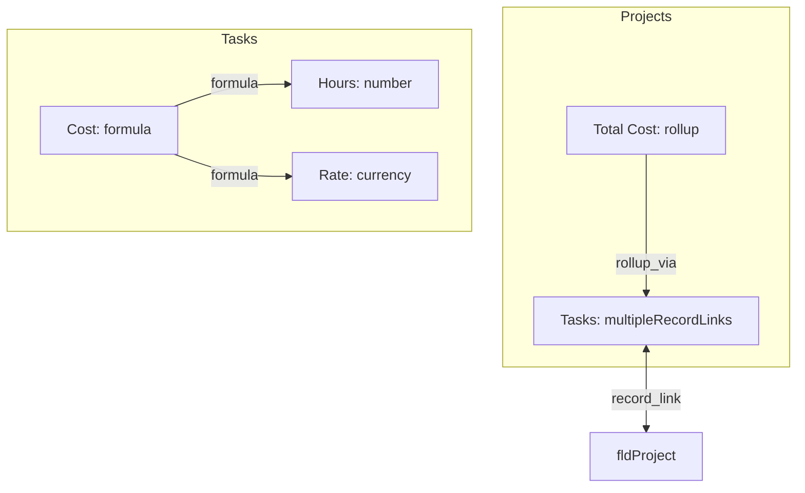

# Architecture Documentation

## Overview

Airtable Analysis Tools is a dual-environment Python application that analyzes Airtable bases through dependency mapping, formula compression, schema generation, and advanced graph-based analysis. The system operates in two distinct contexts:

1. **CLI Environment**: Server-side Python application using standard libraries
2. **Web Environment**: Browser-based PyScript application with no backend

Both environments share core analysis modules but execute in fundamentally different runtime contexts.

---

## Technology Stack

### Core Technologies

#### Python Ecosystem
- **Python 3.12+**: Minimum version requirement for modern type hints and performance
- **uv**: Fast Python package installer and project manager (replaces pip/poetry)
- **NetworkX 3.6.1+**: Graph-based dependency analysis and traversal algorithms
- **Typer**: CLI framework with automatic help generation
- **httpx**: Modern async HTTP client for Airtable API calls (CLI only)
- **PyScript 0.3.3+**: Browser-based Python runtime using Pyodide/WebAssembly

#### Frontend Technologies
- **PyScript 2025.2.3**: Python-in-browser runtime (Pyodide + WebAssembly)
- **Tailwind CSS 3.4.17**: Utility-first CSS framework with JIT compilation
- **TypeScript 5.9.3**: Type-safe JavaScript for web components
- **Mermaid.js**: Flowchart rendering from text definitions
- **Web Components**: Custom HTML elements for reusable UI (theme-toggle, at-dropdown, tab-manager)

#### Build & Development Tools
- **npm**: Node package manager for frontend dependencies
- **Tailwind CLI**: Standalone CSS compilation (no PostCSS needed)
- **TypeScript Compiler**: Compiles TypeScript to ES modules
- **pytest**: Python testing framework with coverage reporting
- **GitHub Actions**: CI/CD automation for deployment

---

## Dual Architecture Pattern

### Architectural Philosophy

The project uses a **shared-module architecture** where core analysis logic is written once and executed in two fundamentally different environments:

```
┌─────────────────────────────────────────────────────────────┐
│                    Core Analysis Modules                     │
│  (at_metadata_graph.py, airtable_mermaid_generator.py, etc) │
└────────────┬──────────────────────────────┬─────────────────┘
             │                              │
             ▼                              ▼
    ┌────────────────┐           ┌─────────────────────┐
    │  CLI Context   │           │   Web Context       │
    │  (Server-side) │           │   (Browser-side)    │
    ├────────────────┤           ├─────────────────────┤
    │ • Full stdlib  │           │ • Limited stdlib    │
    │ • httpx/async  │           │ • No HTTP (Python)  │
    │ • File system  │           │ • localStorage API  │
    │ • Direct exec  │           │ • JS interop layer  │
    └────────────────┘           └─────────────────────┘
```

### CLI Environment (`main.py`)

**Purpose**: Server-side analysis, batch processing, automation scripts

**Architecture**:
```python
# main.py - CLI entry point
import typer
from at_metadata_graph import metadata_to_graph
from airtable_mermaid_generator import graph_to_mermaid

app = typer.Typer()

@app.command()
def analyze(base_id: str):
    """Analyze Airtable base from command line"""
    metadata = fetch_from_airtable_api(base_id)
    graph = metadata_to_graph(metadata)
    # ... perform analysis
```

**Key Characteristics**:
- Uses standard Python libraries (`httpx`, file I/O)
- Direct Airtable API access with authentication
- Can write files, execute system commands
- Suitable for automation and CI/CD integration

**Running the CLI**:
```bash
uv run python main.py analyze tblXXXXXXXXXXXXXX
uv run python main.py run-web  # Start local dev server
```

### Web Environment (`web/`)

**Purpose**: Interactive browser-based analysis without backend infrastructure

**Architecture**:
```
web/index.html (Entry Point)
    ↓
web/main.py (Tab Coordinator)
    ├── tabs/dependency_mapper.py
    ├── tabs/formula_compressor.py
    ├── tabs/complexity_scorecard.py
    └── tabs/... (9 independent tabs)
        ↓
    Shared Modules:
    ├── at_metadata_graph.py (Graph operations)
    ├── airtable_mermaid_generator.py (Diagram generation)
    ├── components/airtable_client.py (localStorage abstraction)
    └── components/error_handling.py (Standardized errors)
```

**Key Characteristics**:
- **Zero backend**: All computation in browser via PyScript
- **JavaScript ↔ Python bridge**: API calls in JS, analysis in Python
- **localStorage**: Persists metadata between sessions
- **Module isolation**: Each tab is self-contained (~50-200 lines)

---

## PyScript Integration

### Why PyScript?

PyScript enables running Python code directly in the browser without a backend server, allowing:
- Complex graph algorithms (NetworkX) in the browser
- Code reuse between CLI and web environments
- Zero infrastructure costs (static site deployment)
- Offline operation after initial load

### How PyScript Works

```
┌──────────────────────────────────────────────────────────────┐
│ Browser Environment                                           │
│                                                               │
│  ┌───────────────┐          ┌──────────────────────┐        │
│  │  JavaScript   │  ◄────►  │  PyScript/Pyodide   │        │
│  │  (UI, API)    │          │  (Python Runtime)    │        │
│  └───────────────┘          └──────────────────────┘        │
│         │                             │                      │
│         │ window.pythonFunc()         │ Python analysis     │
│         │                             │ NetworkX graphs     │
│         ▼                             ▼                      │
│    DOM Updates                  Print to console            │
└──────────────────────────────────────────────────────────────┘
```

### Configuration: `web/pyscript.toml`

```toml
name = "Airtable Analysis Tools"
version = "0.2.0"
packages = ["networkx"]  # Python packages available in browser

[files]
"./at_metadata_graph.py" = "at_metadata_graph.py"
"./tabs/dependency_mapper.py" = "tabs/dependency_mapper.py"
# ... all Python modules mapped for browser access
```

**Auto-generation**: `scripts/generate_pyscript_config.py` discovers all `.py` files in `web/` and updates the `[files]` section automatically.

### Python ↔ JavaScript Communication

**Pattern 1: Export Python functions to JavaScript**
```python
# Python (web/tabs/dependency_mapper.py)
from pyscript import window

def generate_diagram(field_id: str) -> str:
    # ... analysis logic
    return mermaid_text

# Export to global scope
window.generateDiagram = generate_diagram
```

```javascript
// JavaScript (web/script.js)
async function handleGenerateClick() {
    const result = await window.generateDiagram(fieldId);
    document.getElementById('output').innerHTML = result;
}
```

**Pattern 2: Access browser APIs from Python**
```python
from pyscript import document, window

# DOM manipulation
element = document.getElementById("output")
element.innerHTML = "<p>Updated from Python</p>"

# localStorage access
metadata = window.localStorage.getItem("airtableMetadata")
```

### PyScript Limitations & Workarounds

| Limitation | Workaround |
|------------|------------|
| No `httpx`/`requests` | JavaScript `fetch()` → localStorage → Python reads |
| No file system | localStorage API for persistence |
| Slower startup (~2-5s) | Loading indicator, async initialization |
| Limited stdlib | Use browser APIs via `window` object |
| Print to console only | Use DOM manipulation for user-facing output |

---

## Graph-Based Analysis Core

### The NetworkX Foundation

All analysis tools revolve around a **directed graph (DiGraph)** created by `metadata_to_graph()`:

```python
from at_metadata_graph import metadata_to_graph
import networkx as nx

# Convert Airtable metadata to graph
G = metadata_to_graph(airtable_metadata)

# Graph structure:
# - Nodes: Fields (with metadata) and tables
# - Edges: Dependencies (formula refs, lookups, rollups, links)
# - Edge attributes: 'relationship' (e.g., "formula", "lookup", "rollup_via")
```

### Graph Node Structure

```python
# Field node
{
    'id': 'fldXXXXXXXXXXXXXX',
    'name': 'Total Cost',
    'type': 'formula',
    'table_id': 'tblProjects',
    'table_name': 'Projects',
    'field_metadata': {...}  # Full Airtable field metadata
}

# Table node
{
    'id': 'tblProjects',
    'name': 'Projects',
    'type': 'table'
}
```

### Edge Types & Relationships

| Edge Type | Source → Target | Relationship Attribute |
|-----------|-----------------|------------------------|
| **Formula** | Formula field → Referenced field | `"formula"` |
| **Lookup** | Lookup field → Linked field → Field in linked table | `"lookup"`, `"lookup_via"` |
| **Rollup** | Rollup field → Linked field → Field in linked table | `"rollup"`, `"rollup_via"` |
| **Count** | Count field → Record link field | `"count"` |
| **Record Link** | Link field ↔ Inverse link field | `"record_link"` (bidirectional) |

### Graph Traversal Patterns

**Common Pattern**: `metadata → graph → subgraph → visualization`

```python
# 1. Build full graph
G = metadata_to_graph(metadata)

# 2. Extract relevant subgraph
from at_metadata_graph import get_reachable_nodes
subgraph = get_reachable_nodes(
    G, 
    field_id="fldTotalCost",
    direction="backward"  # What this field depends on
)

# 3. Generate Mermaid diagram
from airtable_mermaid_generator import graph_to_mermaid
mermaid = graph_to_mermaid(subgraph, direction="TD")

# 4. Render in browser
window.mermaid.render('mermaid-output', mermaid)
```

**Traversal Directions**:
- `backward`: Ancestors (what this field depends on)
- `forward`: Descendants (what depends on this field)
- `both`: Full dependency graph (default)

---

## Advanced Tooling & Logic

### Formula Compression Algorithm

**Purpose**: Recursively inline helper fields into main formulas for understanding total calculations without jumping between fields.

**Algorithm** (`web/tabs/formula_compressor.py`):

```python
def _compress_formula_recursive(
    formula: str,
    metadata: dict,
    max_depth: Optional[int],
    depth: int,
    visited_fields: set
) -> Tuple[str, int]:
    """
    Key implementation details:
    1. Check depth limit (prevents infinite recursion)
    2. Find all field references: {fldXXXXXXXXXXXXXX}
    3. Process in REVERSE order (maintains string positions)
    4. Circular reference protection (visited_fields set)
    5. Replace only formula fields recursively
    6. Wrap replacements in parens (operator precedence safety)
    7. Track maximum depth reached
    """
```

**Example**:
```
Before:
  Field A: AND({B}, {C})
  Field B: {D} + {E}
  Field C: OR({D}, NOT({E}))
  
After compression (depth=None):
  AND(({D} + {E}), (OR({D}, NOT({E}))))
  
Max depth reached: 2
```

**Key Features**:
- **Reverse iteration**: Process matches from end to start (avoids index shifting)
- **Visited set copying**: Each recursion branch gets own copy (allows same field in different branches)
- **Parenthesization**: Always wrap in `()` to preserve precedence
- **Two-phase conversion**: Compress with IDs, then convert to names if requested

### Mermaid Diagram Generation

**Purpose**: Convert NetworkX graphs to Mermaid flowchart syntax for visualization.

**Architecture** (`airtable_mermaid_generator.py`):

```python
def graph_to_mermaid(
    G: nx.DiGraph,
    direction: Literal["TD", "LR", "RL", "BT"] = "TD",
    display_mode: Literal["simple", "descriptions", "formulas", "all"] = "simple"
) -> str:
    """
    Display modes:
    - simple: Field names only
    - descriptions: + Field type descriptions
    - formulas: + Formula text (for formula fields)
    - all: Everything
    
    Features:
    - Automatic table grouping (subgraphs)
    - Escapes parentheses (avoids Mermaid syntax conflicts)
    - Color coding by field type
    - Bidirectional edge detection (record links)
    """
```

**Generated Output**:


### Dependency Analysis & Complexity Scoring

**Complexity Scorecard** (`web/tabs/complexity_scorecard.py`):

Calculates complexity metrics for each field:

```python
def calculate_complexity(field_id: str, graph: nx.DiGraph) -> dict:
    """
    Metrics:
    - Direct dependencies: Immediate predecessors
    - Total dependencies: All reachable ancestors (backward traversal)
    - Dependents: Fields that use this field (forward traversal)
    - Depth: Longest path from basic fields
    - Complexity score: Weighted combination of above
    """
    subgraph = get_reachable_nodes(graph, field_id, direction="backward")
    return {
        "direct_deps": graph.in_degree(field_id),
        "total_deps": len(subgraph.nodes()) - 1,
        "depth": nx.dag_longest_path_length(subgraph),
        "score": calculate_weighted_score(...)
    }
```

### Unused Fields Detection

**Algorithm** (`web/tabs/unused_fields.py`):

```python
def find_unused_fields(graph: nx.DiGraph) -> list[str]:
    """
    A field is unused if:
    1. in_degree == 0 (nothing depends on it)
    2. type is computed (formula/rollup/lookup/count)
    3. Not excluded by user (has use case outside Airtable)
    """
    unused = []
    for node, data in graph.nodes(data=True):
        if data.get('type') == 'field':
            if (graph.in_degree(node) == 0 and 
                data.get('field_type') in COMPUTED_FIELD_TYPES):
                unused.append(node)
    return unused
```

### TypeScript Type Generation

**Purpose**: Generate TypeScript interfaces from Airtable schema for type-safe API clients.

**Features** (`web/types_generator.py`):
- Converts Airtable field types to TypeScript types
- Handles linked record relationships
- Generates helper functions for record retrieval
- Multi-file output with index.ts barrel export

**Example Output**:
```typescript
export interface Task {
    id: string;
    taskName?: string;
    hours?: number;
    cost?: number;
    project?: string[];  // Linked record IDs
}

export interface Project {
    id: string;
    projectName?: string;
    totalCost?: number;
}

// Helper functions
export function getTaskProject(task: Task, projects: Project[]): Project | undefined {
    return projects.find(p => task.project?.includes(p.id));
}
```

---

## Build System & Asset Pipeline

### Tailwind CSS Compilation

**Architecture**:
```
web/input.css (Directives)
    ↓ (Tailwind CLI scans content)
web/**/*.{html,js,py}
    ↓ (JIT compilation)
web/output.css (Minified, ~27KB)
```

**Configuration** (`tailwind.config.js`):
```javascript
module.exports = {
  content: ["./web/**/*.{html,js,py}"],
  darkMode: 'class',  // Manual toggle via .dark class
  theme: {
    extend: {
      colors: {
        primary: { /* 50-900 blue palette */ }
      }
    }
  }
}
```

**Build Commands** (`package.json`):
```bash
npm run build:css    # One-time build (required before deployment)
npm run watch:css    # Watch mode for active development
npm run build:ts     # Compile TypeScript to ES modules
npm run build        # Build both CSS and TypeScript
```

**Important**: `web/output.css` is gitignored and MUST be built before running the app. Missing this file results in unstyled HTML.

### PyScript Configuration Generation

**Purpose**: Auto-discover Python modules and generate PyScript configuration.

**Script** (`scripts/generate_pyscript_config.py`):
```python
import tomli_w
from pathlib import Path

def generate_config():
    """
    1. Find all .py files in web/
    2. Generate relative path mappings
    3. Update [files] section in web/pyscript.toml
    4. Preserve other config sections
    """
    web_dir = Path("web")
    py_files = web_dir.rglob("*.py")
    
    files_mapping = {
        f"./{file.relative_to(web_dir)}": str(file.relative_to(web_dir))
        for file in py_files
    }
    
    config["files"] = files_mapping
    # Write back to pyscript.toml
```

**Usage**:
```bash
# Manual regeneration
uv run python scripts/generate_pyscript_config.py

# Automatic in CI/CD (see GitHub Actions below)
```

### TypeScript Compilation

**Configuration** (`tsconfig.json`):
```json
{
  "compilerOptions": {
    "target": "ES2022",
    "module": "ES2022",
    "outDir": "./web/src",
    "rootDir": "./web/src",
    "strict": true,
    "moduleResolution": "node"
  }
}
```

**Output**: TypeScript files in `web/src/*.ts` compile to ES modules loaded by `index.html`.

---

## GitHub CI/CD Workflow

### Deployment Pipeline (`.github/workflows/static.yml`)

**Trigger**: Push to `main` branch or manual workflow dispatch

**Architecture**:
```
┌─────────────────────────────────────────────────────────────┐
│ GitHub Actions Runner (Ubuntu Latest)                       │
├─────────────────────────────────────────────────────────────┤
│ 1. Checkout repo (full history for git describe)           │
│ 2. Setup Node.js 20                                         │
│ 3. npm ci (install dependencies)                            │
│ 4. npm run build (CSS + TypeScript)                         │
│ 5. Setup Python 3.12                                        │
│ 6. pip install tomli tomli-w                                │
│ 7. python scripts/generate_pyscript_config.py               │
│ 8. Inject version number into HTML                          │
│ 9. Upload web/ directory as Pages artifact                  │
│ 10. Deploy to GitHub Pages                                  │
└─────────────────────────────────────────────────────────────┘
```

### Key Steps Explained

**Step 1-4: Frontend Build**
```yaml
- name: Set up Node.js
  uses: actions/setup-node@v4
  with:
    node-version: '20'

- name: Install Node dependencies
  run: npm ci

- name: Build CSS and TypeScript
  run: npm run build
```

**Step 5-7: Python Configuration**
```yaml
- name: Set up Python
  uses: actions/setup-python@v5
  with:
    python-version: '3.12'

- name: Install tomli for version reading
  run: pip install tomli tomli-w

- name: Generate PyScript configuration
  run: python scripts/generate_pyscript_config.py
```

**Step 8: Dynamic Version Injection**
```yaml
- name: Inject version into HTML
  run: |
    # Read version from pyproject.toml
    VERSION=$(python3 -c "import tomli; f=open('pyproject.toml','rb'); print(tomli.load(f)['project']['version'])")
    COMMIT_SHA=$(git rev-parse --short HEAD)
    
    # Check if tagged release
    if git describe --exact-match --tags HEAD 2>/dev/null; then
      VERSION_STRING="v${VERSION}"
    else
      VERSION_STRING="v${VERSION}-${COMMIT_SHA}"
    fi
    
    # Replace in HTML
    sed -i "s|<span id=\"app-version\">v0.1.0</span>|<span id=\"app-version\">${VERSION_STRING}</span>|g" web/index.html
```

**Step 9-10: Deployment**
```yaml
- name: Upload artifact
  uses: upload-pages-artifact@v3
  with:
    path: './web'

- name: Deploy to GitHub Pages
  uses: deploy-pages@v4
```

### Deployment Permissions

```yaml
permissions:
  contents: read      # Read repository
  pages: write        # Write to GitHub Pages
  id-token: write     # OIDC authentication
```

### Concurrency Control

```yaml
concurrency:
  group: "pages"
  cancel-in-progress: false  # Don't cancel running deployments
```

---

## Unit Test Environment

### Test Framework Architecture

**Technology Stack**:
- **pytest**: Test runner and framework
- **pytest-cov**: Coverage reporting
- **pytest-asyncio**: Async test support
- **unittest.mock**: PyScript mocking

**Project Structure**:
```
tests/
├── conftest.py                    # Shared fixtures, PyScript mocking
├── test_at_metadata_graph.py      # Graph operations
├── test_formula_compressor.py     # Compression algorithm
├── test_mermaid_generator.py      # Diagram generation
├── test_complexity_scorecard.py   # Complexity scoring
├── test_types_generator.py        # TypeScript generation
└── ... (24 test files total)
```

### PyScript Mocking Setup

**Problem**: Web modules import `from pyscript import document, window`, but PyScript only exists in browser.

**Solution** (`tests/conftest.py`):
```python
import sys
from unittest.mock import MagicMock
from pathlib import Path

# Mock PyScript BEFORE importing any web modules
sys.modules['pyscript'] = MagicMock()

# Add web directory to path
sys.path.insert(0, str(Path(__file__).parent.parent / "web"))

# Now all tests can import web modules safely
```

**Why This Works**:
1. Mocks PyScript globally before any imports
2. `sys.path.insert(0, ...)` prioritizes web directory
3. All tests inherit this setup automatically
4. MagicMock allows `document.getElementById()` calls without errors

### Test Configuration (`pytest.ini`)

```ini
[pytest]
testpaths = tests
python_files = test_*.py
addopts = 
    -v                          # Verbose output
    --strict-markers            # Enforce marker registration
    --tb=short                  # Short traceback format
    --cov=web                   # Coverage source
    --cov-report=term-missing   # Show missing lines in terminal
    --cov-report=html           # Generate HTML report

[coverage:run]
source = web                    # Only track web/ directory
omit = 
    */tests/*                   # Exclude test files
    */__pycache__/*             # Exclude cache
    */test_*.py                 # Exclude test modules

[coverage:report]
exclude_lines = 
    pragma: no cover
    def __repr__
    if __name__ == .__main__.:
    if TYPE_CHECKING:
```

### Shared Test Fixtures (`conftest.py`)

```python
@pytest.fixture
def minimal_metadata():
    """Minimal valid Airtable metadata structure"""
    return {
        "tables": [{
            "id": "tbl1",
            "name": "Table 1",
            "fields": [{
                "id": "fld1",
                "name": "Field 1",
                "type": "singleLineText",
            }]
        }]
    }

@pytest.fixture
def complex_metadata():
    """Complex metadata with multiple field types and dependencies"""
    # Tasks table with formula, links
    # Projects table with rollup, count
    # Full graph topology for testing
    return {...}
```

### Running Tests

```bash
# Run all tests with coverage
uv run pytest

# Run specific test file
uv run pytest tests/test_at_metadata_graph.py -v

# Run with HTML coverage report
uv run pytest --cov-report=html
open htmlcov/index.html

# Run tests matching pattern
uv run pytest -k "formula" -v
```

### Coverage Goals

| Component | Target Coverage |
|-----------|----------------|
| Core business logic | 80%+ |
| Graph operations | 90%+ |
| Error handling | 70%+ |
| UI components | 60%+ |

### Test Import Pattern

**For tests using conftest fixtures**:
```python
import pytest

def test_metadata_to_graph(minimal_metadata):
    from at_metadata_graph import metadata_to_graph
    G = metadata_to_graph(minimal_metadata)
    assert len(G.nodes()) > 0
```

**For standalone test files**:
```python
import sys
from pathlib import Path

# Add web directory before importing
sys.path.insert(0, str(Path(__file__).parent.parent / "web"))

from at_metadata_graph import metadata_to_graph
from constants import FIELD_TYPE_FORMULA

def test_something():
    # ... test code
```

---

## Dependency Management

### Python Dependencies (`pyproject.toml`)

**Production**:
```toml
dependencies = [
    "httpx>=0.28.1",        # HTTP client (CLI only)
    "networkx>=3.6.1",      # Graph algorithms (both CLI & web)
    "pyscript>=0.3.3",      # Browser Python runtime (web only)
    "python-dotenv>=1.2.1", # Environment variable loading
    "tomli-w>=1.1.0",       # TOML writing (config generation)
    "typer>=0.9.0",         # CLI framework
]
```

**Development**:
```toml
[dependency-groups]
dev = [
    "pytest>=8.0.0",          # Test framework
    "pytest-cov>=6.0.0",      # Coverage reporting
    "pytest-asyncio>=0.24.0", # Async test support
]
```

**Installation**:
```bash
uv sync                  # Install production deps
uv sync --group dev      # Install dev deps
```

### Node Dependencies (`package.json`)

**All DevDependencies** (no runtime JS dependencies):
```json
{
  "devDependencies": {
    "@types/node": "^25.0.3",      # Node.js type definitions
    "concurrently": "^9.2.1",      # Run multiple watch commands
    "tailwindcss": "^3.4.17",      # CSS framework
    "typescript": "^5.9.3"         # TypeScript compiler
  }
}
```

**Installation**:
```bash
npm install              # Install all dependencies
npm ci                   # Clean install (CI/CD)
```

---

## File Organization

```
.
├── main.py                      # CLI entry point
├── pyproject.toml               # Python project config
├── pytest.ini                   # Test configuration
├── package.json                 # Node.js dependencies
├── tailwind.config.js           # Tailwind customization
├── tsconfig.json                # TypeScript config
├── .github/
│   └── workflows/
│       └── static.yml           # CI/CD pipeline
├── scripts/
│   └── generate_pyscript_config.py  # Auto-generate pyscript.toml
├── tests/                       # Unit tests (pytest)
│   ├── conftest.py              # Shared fixtures
│   └── test_*.py                # Test modules
└── web/                         # Web application
    ├── index.html               # Entry point
    ├── script.js                # JavaScript coordination
    ├── input.css                # Tailwind directives
    ├── output.css               # Generated CSS (gitignored)
    ├── pyscript.toml            # PyScript configuration
    ├── main.py                  # Tab coordinator
    ├── at_metadata_graph.py     # Graph operations
    ├── airtable_mermaid_generator.py  # Diagram generation
    ├── constants.py             # Shared constants
    ├── at_types.py              # Type definitions
    ├── components/              # Shared utilities
    │   ├── airtable_client.py   # localStorage abstraction
    │   ├── error_handling.py    # Standardized errors
    │   ├── code_display.py      # Code formatting helpers
    │   └── ui/                  # Web components
    │       ├── theme-toggle.js  # Dark mode toggle
    │       ├── at-dropdown.js   # Custom dropdown
    │       └── tab-manager.js   # Tab switching
    ├── tabs/                    # Independent tab modules
    │   ├── dependency_mapper.py
    │   ├── formula_compressor.py
    │   ├── complexity_scorecard.py
    │   └── ... (9 tabs total)
    └── src/                     # TypeScript sources
        └── *.ts                 # Web component TypeScript
```

---

## Key Design Patterns

### 1. Module Path Management

All web modules use this pattern for imports:
```python
import sys
sys.path.append("web")

from components.airtable_client import get_local_storage_metadata
from at_metadata_graph import metadata_to_graph
```

### 2. Error Handling

Standardized error handling across all tabs:
```python
from components.error_handling import handle_tab_error, validate_metadata

try:
    metadata = validate_metadata(get_metadata())
    # ... operation
except AnalysisError as e:
    handle_tab_error(e, "generating diagram", "output-element-id")
```

### 3. Code Display Components

Always use reusable helpers for code blocks:
```python
from components.code_display import create_code_block

html = create_code_block(
    code_string,
    show_copy_button=True,
    copy_button_id="copy-btn"
)
```

Ensures proper dark mode support: `text-gray-800 dark:text-gray-200`

### 4. Tab Initialization Pattern

Each tab follows this structure:
```python
"""Tab Name - Brief description"""
from pyscript import document, window
import sys
sys.path.append("web")

def initialize():
    """Initialize the tab"""
    window.myFunction = my_function  # Export to JS
    print("Tab initialized")

def my_function(arg):
    """Implementation"""
    # ... logic
    return result
```

---

## Common Pitfalls & Solutions

| Pitfall | Solution |
|---------|----------|
| PyScript `httpx` not available | Use JavaScript `fetch()` → localStorage → Python reads |
| Import errors in browser | Ensure `sys.path.append("web")` in all web modules |
| Unstyled HTML | Run `npm run build:css` to generate output.css |
| Test import failures | Add `sys.path.insert(0, "web")` in test files |
| Dark mode unreadable | Use `text-gray-800 dark:text-gray-200` on all text |
| Circular dependencies in formulas | Use `visited_fields` set in recursive traversals |
| Mermaid syntax errors | Escape parentheses in field names/descriptions |
| Missing PyScript in tests | Mock in conftest.py before importing web modules |

---

## Performance Characteristics

### CLI Environment
- **Startup**: Instant (standard Python)
- **Analysis**: ~100ms for medium bases (50 tables, 500 fields)
- **Large bases**: ~1-2s (200 tables, 2000+ fields)

### Web Environment
- **Initial load**: 2-5s (PyScript/Pyodide initialization)
- **Subsequent analysis**: Similar to CLI after load
- **localStorage**: ~10-50ms for metadata save/load
- **Mermaid rendering**: ~50-200ms depending on graph size

### Optimization Strategies
- **Lazy tab loading**: Tabs initialize on demand
- **Graph caching**: Build once, traverse many times
- **Incremental updates**: Only rebuild affected subgraphs
- **CSS minification**: Tailwind JIT reduces output.css to ~27KB

---

## Security Considerations

1. **No secrets in code**: Use environment variables (`.env` file)
2. **localStorage only**: No sensitive data in browser storage
3. **GitHub Actions**: Use repository secrets for API keys
4. **Static deployment**: No server-side vulnerabilities
5. **CSP headers**: GitHub Pages provides default CSP

---

## Future Architecture Considerations

### Potential Enhancements
- **Incremental graph updates**: Rebuild only changed subgraphs
- **Web Workers**: Offload graph analysis to background threads
- **IndexedDB**: Migrate from localStorage for larger datasets
- **Service Worker**: Offline-first PWA with caching
- **WASM optimization**: Compile hot paths to WebAssembly
- **Streaming analysis**: Process large bases incrementally

### Scalability Limits
- **Browser memory**: ~500-1000 fields before performance degradation
- **localStorage**: 5-10MB limit (per domain)
- **Mermaid rendering**: ~200 nodes before layout issues
- **PyScript startup**: Fixed ~2-5s overhead (Pyodide load)

---

## Conclusion

This dual-architecture design enables:
- **Code reuse**: 80%+ shared between CLI and web
- **Zero infrastructure**: Static site deployment
- **Powerful analysis**: NetworkX graph algorithms in browser
- **Developer experience**: Modern Python patterns in both environments
- **Maintainability**: Independent tab modules, shared utilities

The system demonstrates that sophisticated data analysis applications can run entirely in the browser without sacrificing functionality or developer ergonomics.
